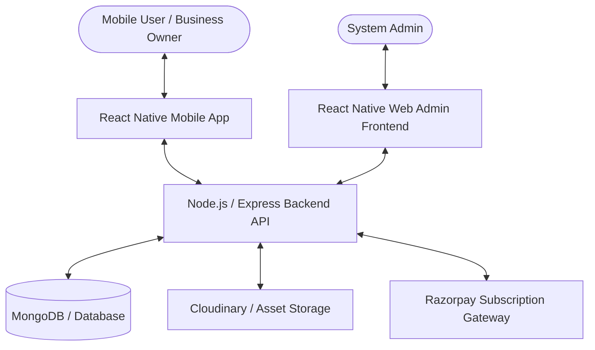
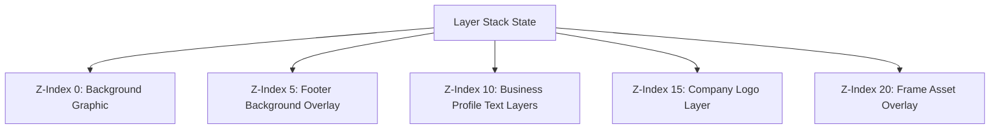
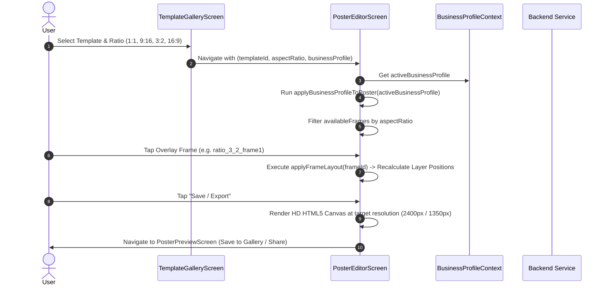

# Market Brand (Event Marketers) - Comprehensive System Documentation

## 1. Executive Summary & Ecosystem Overview

**Market Brand (Event Marketers)** is an end-to-end automated digital marketing platform comprising a React Native mobile application, a Node.js/Express backend API, and a web admin portal. The platform enables small-to-medium businesses (SMBs), freelancers, and digital marketers to generate, edit, brand, and publish professional marketing posters, daily festival graphics, and video posts with dynamic business branding overlays.

### System Components



---

## 2. Technical Stack

### Mobile Application (`eventmarketers-app`)
- **Core Framework**: React Native `0.72.6` with TypeScript `5.0+`
- **Navigation**: `@react-native-navigation/native` with Native Stack & Bottom Tabs
- **UI Engine & Animations**: `react-native-reanimated`, `react-native-linear-gradient`, `react-native-vector-icons`
- **Canvas & Graphics**: Custom HTML5 Canvas renderer via `react-native-canvas`, `react-native-svg`
- **State Management**: React Context API (`BusinessProfileContext`, `ThemeContext`, `AuthContext`)
- **HTTP Client**: Axios with custom interceptors and JWT Bearer token management
- **Storage & Caching**: `@react-native-async-storage/async-storage` with an in-memory/disk caching layer (`cacheService`)
- **Media Processing**: `react-native-image-crop-picker`, `react-native-video`, `react-native-fs`

---

## 3. Project Directory Map (`eventmarketers-app`)

```
eventmarketers-app/
├── android/                   # Native Android project files, Gradle scripts, & Manifest
│   └── app/build.gradle       # Versioning (versionCode 58, versionName "58")
├── ios/                       # Native iOS project configuration & CocoaPods Podfile
├── src/
│   ├── assets/                # App icons, frame overlays, default badges & graphics
│   │   └── frames/            # Frame overlays (1:1, aspect-ratio-frames 9:16, 3:2, 16:9)
│   ├── components/            # Reusable UI components
│   │   ├── BusinessProfileForm.tsx   # Profile create/edit modal form
│   │   ├── PosterCanvas.tsx          # HTML5 Canvas layer rendering engine
│   │   ├── InfoRequiredModal.tsx     # Validation modal for missing profile fields
│   │   └── FloatingInput.tsx         # Animated floating-label text input
│   ├── context/               # Global React Context providers
│   │   ├── BusinessProfileContext.tsx# Active profile selector & global updater
│   │   ├── ThemeContext.tsx          # Light/Dark mode design tokens
│   │   └── AuthContext.tsx           # Authentication session state
│   ├── data/                  # Static assets mappings & layout coordinates
│   │   ├── frames.ts                 # Master frame assets (1:1, 9:16, 3:2, 16:9) & coordinates
│   │   └── videoFrames.ts            # Video frame overlay configurations
│   ├── navigation/            # App stack & tab navigation routers
│   ├── screens/               # Main application screens
│   │   ├── HomeScreen.tsx            # Feed, daily picks, festival calendar, categories
│   │   ├── PosterEditorScreen.tsx    # Interactive poster editor with layer manipulation
│   │   ├── PosterPreviewScreen.tsx   # HD Export & share screen
│   │   ├── VideoEditorScreen.tsx     # Dynamic video composition editor
│   │   ├── BusinessProfilesScreen.tsx# Manage multiple business profiles
│   │   └── TemplateGalleryScreen.tsx # Category & festival template browser
│   ├── services/              # API communications & data access layer
│   │   ├── api.ts                    # Axios client instance with headers & auth
│   │   ├── businessProfile.ts        # Profile CRUD, caching, & backend mapping
│   │   ├── subscription.ts           # Razorpay subscription & mandate management
│   │   ├── cacheService.ts           # In-memory & storage caching utility
│   │   └── auth.ts                   # User authentication & token storage
│   └── utils/                 # Utility functions, notch handlers, & canvas math
├── package.json               # Dependencies & app scripts (v58)
└── DOCUMENTATION.md           # Application documentation master file
```

---

## 4. Core Features & Functional Architecture

### A. Business Profile Management System
The app allows users to maintain multiple business profiles (Company Name, Category, Logo, Phone, Email, Website, Address, Description).
- **Service Layer**: [`businessProfile.ts`](file:///c:/Users/ADMIN/Desktop/MarketBrand/eventmarketers-app/src/services/businessProfile.ts)
- **State Provider**: [`BusinessProfileContext.tsx`](file:///c:/Users/ADMIN/Desktop/MarketBrand/eventmarketers-app/src/context/BusinessProfileContext.tsx)
- **Form Component**: [`BusinessProfileForm.tsx`](file:///c:/Users/ADMIN/Desktop/MarketBrand/eventmarketers-app/src/components/BusinessProfileForm.tsx)

#### In-Memory & Storage Caching Strategy
To ensure instantaneous UI response while maintaining backend consistency:
1. `getUserBusinessProfiles(userId)` queries the local `cacheService` under key `business_profiles_user_v2_${userId}` (TTL 5 minutes).
2. When a profile update occurs, `clearCache(userId)` invalidates both `business_profiles_user_v2_${userId}` and pattern keys `business_profiles_user_`.
3. The PUT update response merges newly updated fields with pre-existing profile properties to prevent missing backend fields from resetting local data to empty strings.

---

### B. Interactive Poster Editor & Canvas Engine
- **Core Screen**: [`PosterEditorScreen.tsx`](file:///c:/Users/ADMIN/Desktop/MarketBrand/eventmarketers-app/src/screens/PosterEditorScreen.tsx)
- **Canvas Element**: [`PosterCanvas.tsx`](file:///c:/Users/ADMIN/Desktop/MarketBrand/eventmarketers-app/src/components/PosterCanvas.tsx)

#### Canvas Layer Architecture
The poster editor operates on a multi-layer stack (`Layer[]`):
- `background`: Template graphic or user background image.
- `text`: Editable text elements (Company Name, Tagline, Contact Details, Description).
- `image`: User uploaded photos or business logos.
- `frame`: Overlay frame graphic bounding the artwork.



#### Field Toggle & Missing Data Handling
1. Users can toggle field visibility (Logo, Company Name, Phone, Email, Website, Category, Address) from the horizontal control bar.
2. If data for a toggled field is missing in the `activeBusinessProfile`, `InfoRequiredModal` pops up.
3. Clicking "Update Profile" opens `BusinessProfileForm` inline without losing current editor state.
4. On save, `applyBusinessProfileToPoster` re-runs immediately, generating layers for newly filled fields, and re-applies active `applyFrameLayout` coordinates.

---

### C. Overlay Frames & Multi-Aspect Ratio Engine
- **Configuration File**: [`frames.ts`](file:///c:/Users/ADMIN/Desktop/MarketBrand/eventmarketers-app/src/data/frames.ts)

The editor dynamically filters overlay frames based on the aspect ratio of the selected template or image:

| Aspect Ratio | Aspect Value | Frame Set Key | Available Overlay Frames |
| :--- | :--- | :--- | :--- |
| **1:1** | `1.0` (Square) | `FRAME_ASSETS` (Standard) | `frame3` – `frame72` |
| **9:16** | `~0.56` (Portrait/Story) | `ASPECT_RATIO_FRAME_ASSETS` | `aspect_frame1` – `aspect_frame15` |
| **3:2** | `~1.50` (Landscape Photo) | `RATIO_3_2_FRAME_ASSETS` | `ratio_3_2_frame1` – `ratio_3_2_frame5` |
| **16:9** | `~1.77` (Widescreen) | `RATIO_16_9_FRAME_ASSETS` | `ratio_16_9_frame1` – `ratio_16_9_frame5` |

When a frame is selected, `applyFrameLayoutToLayers` reads the absolute bounding box coordinates (`x`, `y`, `color`, `circular`, `size`) for that frame ID and aligns all text and logo layers cleanly over the frame artwork.

---

### D. Subscription & Razorpay Autopay Integration
- **Service**: [`subscription.ts`](file:///c:/Users/ADMIN/Desktop/MarketBrand/eventmarketers-app/src/services/subscription.ts)
- Handles automated recurring billing for business profile branding privileges via Razorpay Mandates.
- Checks active subscription status (`getBusinessProfileSubscriptionStatus(profileId)`) before granting high-resolution export or watermark-free downloads.

---

## 5. Primary Data Models

### BusinessProfile Interface
```typescript
interface BusinessProfile {
  id: string;
  name: string;
  description?: string;
  category: string;
  subCategory?: string;
  subcategory?: string;
  address?: string;
  phone?: string;
  alternatePhone?: string;
  email?: string;
  website?: string;
  logo?: string;
  companyLogo?: string;
  banner?: string;
  services?: string[];
  createdAt?: string;
  updatedAt?: string;
  subscriptionStatus?: string;
  isSubscriptionActive?: boolean;
}
```

### Layer Interface (Poster Engine)
```typescript
interface Layer {
  id: string;
  type: 'text' | 'image' | 'shape' | 'frame';
  content?: string;
  position: { x: number; y: number };
  size: { width: number; height: number };
  rotation: number;
  zIndex: number;
  fieldType?: string; // 'logo' | 'companyName' | 'phone' | 'email' | 'website' | 'category' | 'address' | 'description'
  style?: {
    fontSize?: number;
    color?: string;
    fontFamily?: string;
    fontWeight?: string;
    textAlign?: 'left' | 'center' | 'right';
  };
}
```

---

## 6. End-to-End Execution Sequence

### Poster Editing & Export Sequence



---

## 7. Developer Reference & Commands

### Prerequisites
- Node.js `18.x` or higher
- Android SDK (API 33+) & Java JDK 11/17
- Xcode 14+ (for iOS builds)

### Installation & Local Run
```bash
# Navigate to app directory
cd eventmarketers-app

# Install Node dependencies
npm install

# Run Android emulator / connected device
npx react-native run-android

# Run iOS simulator (macOS only)
cd ios && pod install && cd ..
npx react-native run-ios
```

### Verification & Quality Checks
```bash
# TypeScript compilation check (no emit)
npx tsc --noEmit

# Lint check
npm run lint
```

### Production Release Build (Android)
```bash
cd android
./gradlew assembleRelease
# Output APK: android/app/build/outputs/apk/release/app-release.apk
```

---

## 8. Version Release Notes (Version 58)

- **Business Profile Synchronization**: Fixed profile update layer sync in `PosterEditorScreen.tsx` ensuring newly updated profile fields immediately generate canvas layers.
- **Cache Key Invalidation**: Resolved `_v2_` cache key mismatch in `businessProfile.ts` preventing stale cache reads upon saving profile edits.
- **Data Preservation**: Protected profile properties from being reset to empty strings during partial API PUT responses.
- **Aspect Ratio Frame Engine**: Added complete support and asset maps for **3:2** (`ratio_3_2_frame1..5`) and **16:9** (`ratio_16_9_frame1..5`) overlay frames.
- **Dynamic Filtering**: Implemented strict aspect-ratio filtering for overlay frames in `PosterEditorScreen.tsx` (1:1, 9:16, 3:2, 16:9).
